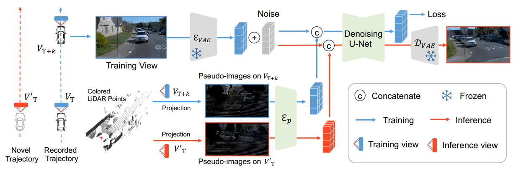

# FreeVS
## FreeVS: Generative View Synthesis on Free Driving Trajectory
[[Qitai Wang]](https://github.com/esdolo), [Lue Fan*](https://lue.fan/), [Yuqi Wang*](https://robertwyq.github.io/), [Yuntao Chen†](https://scholar.google.com/citations?user=iLOoUqIAAAAJ), [Zhaoxiang Zhang†](https://zhaoxiangzhang.net/)
(†: Corresponding Author)

[[arXiv](https://arxiv.org/abs/2311.17918)] [[Project page](https://drive-wm.github.io/)]

## Introduction
We propose a fully generative novel view synthesis method that can generate camera views in free trajectories in real 3D scenes.
<div align="center">
  
</div><br/>

## Get Started
Our code is based on the open-source project diffusers.

<!--
## Citation
```
@article{wang2023driving,
  title={Driving into the Future: Multiview Visual Forecasting and Planning with World Model for Autonomous Driving},
  author={Wang, Yuqi and He, Jiawei and Fan, Lue and Li, Hongxin and Chen, Yuntao and Zhang, Zhaoxiang},
  journal={arXiv preprint arXiv:2311.17918},
  year={2023}
}
```
-->

## Acknowledgement 
Many thanks to the following open-source projects:
* [diffusers](https://github.com/huggingface/diffusers)
